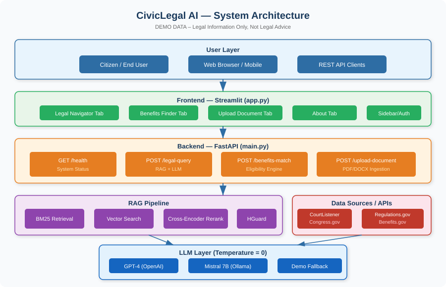
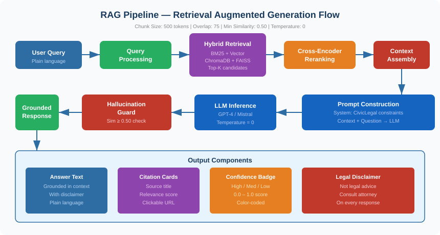
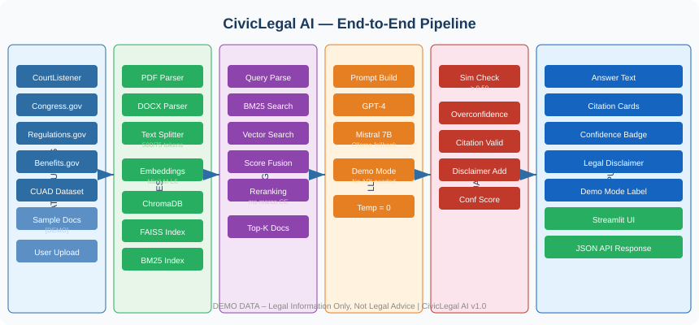
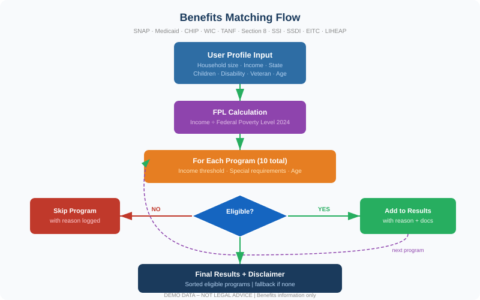
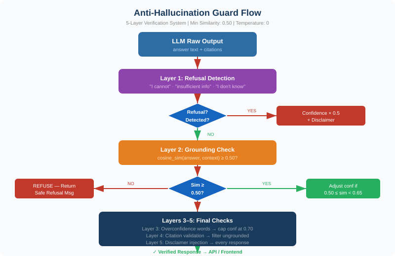

# ⚖️ CivicLegal AI

**AI-Powered Citizen Legal Rights & Government Services Navigator**

> **LEGAL DISCLAIMER:** CivicLegal AI provides general legal **INFORMATION** only — NOT legal advice. This system does not create an attorney-client relationship. For advice specific to your situation, consult a licensed attorney.

---

## Overview

CivicLegal AI is an open-source Retrieval-Augmented Generation (RAG) web application that helps citizens ask plain-language questions about their legal rights and government benefits. It retrieves information from federal legal sources, applies an anti-hallucination guard, and delivers grounded, cited responses — all without requiring legal expertise from the user.

**Demo mode works without any API keys.** All responses are clearly labeled `[DEMO DATA – NOT LEGAL ADVICE]`.

---

## Problem Statement

Millions of Americans cannot afford legal counsel and don't know where to turn for basic legal information. Existing resources are fragmented across government websites, court databases, and benefit portals. CivicLegal AI bridges this gap by:

- Translating complex legal language into plain English
- Matching users to government benefit programs
- Providing cited, grounded legal information with confidence scores
- Operating safely through a 5-layer anti-hallucination system

---

## System Architecture



---

## RAG Pipeline



---

## CivicLegal Pipeline



---

## Benefits Matching Flow



---

## Anti-Hallucination Guard



---

## Project Structure

```
antigravity/civiclegal-ai/
├── frontend/
│   └── app.py                  # Streamlit UI
├── backend/
│   ├── main.py                 # FastAPI endpoints
│   ├── benefits_matcher.py     # Eligibility engine
│   └── api_clients/
│       ├── congress_client.py
│       ├── regulations_client.py
│       ├── courtlistener_client.py
│       └── benefits_client.py
├── rag/
│   ├── rag_pipeline.py         # Hybrid RAG orchestration
│   ├── ingestion.py            # Document chunking & indexing
│   └── hallucination_guard.py  # 5-layer safety system
├── data/
│   └── sample_legal_docs/      # Demo legal documents
├── docs/
│   ├── images/                 # SVG diagrams
│   ├── README.md
│   ├── documentation.md
│   ├── presentation.md
│   ├── demo_output.html
│   └── index.html
├── tests/
│   ├── test_health.py
│   ├── test_benefits_matcher.py
│   └── test_hallucination_guard.py
├── requirements.txt
├── .env.example
└── render.yaml
```

---

## Setup & Local Run

### Prerequisites
- Python 3.11
- pip
- (Optional) OpenAI API key for GPT-4
- (Optional) Ollama for local Mistral 7B

### 1. Clone the Repository

```bash
git clone https://github.com/dp2426-NAU/Civiclegal.git
cd Civiclegal/antigravity/civiclegal-ai
```

### 2. Create Virtual Environment

```bash
python -m venv venv
# Windows
venv\Scripts\activate
# macOS/Linux
source venv/bin/activate
```

### 3. Install Dependencies

```bash
pip install -r requirements.txt
```

### 4. Configure Environment

```bash
cp .env.example .env
# Edit .env and add your API keys (all optional for demo mode)
```

### 5. Run Backend (FastAPI)

```bash
cd backend
uvicorn main:app --reload --port 8000
```

Backend available at: `http://localhost:8000`
API docs at: `http://localhost:8000/docs`

### 6. Run Frontend (Streamlit)

```bash
cd frontend
streamlit run app.py
```

Frontend available at: `http://localhost:8501`

---

## Demo Mode

Set `USE_DEMO_DATA=true` in `.env` (default). All responses will be clearly labeled with `[DEMO DATA – NOT LEGAL ADVICE]`. No API keys required.

---

## API Examples

### Health Check

```bash
curl http://localhost:8000/health
```

```json
{
  "status": "healthy",
  "service": "CivicLegal AI",
  "version": "1.0.0",
  "demo_mode": true,
  "disclaimer": "..."
}
```

### Legal Query

```bash
curl -X POST http://localhost:8000/legal-query \
  -H "Content-Type: application/json" \
  -d '{"question": "What are my rights as a tenant?", "jurisdiction": "federal"}'
```

```json
{
  "answer": "[DEMO DATA] Tenants generally have the right to...",
  "citations": [{"title": "Fair Housing Act", "url": "...", "relevance": 0.92}],
  "confidence": 0.87,
  "disclaimer": "LEGAL DISCLAIMER: ...",
  "demo_mode": true
}
```

### Benefits Match

```bash
curl -X POST http://localhost:8000/benefits-match \
  -H "Content-Type: application/json" \
  -d '{
    "household_size": 3,
    "annual_income": 28000,
    "state": "California",
    "has_children": true
  }'
```

---

## Render Deployment

This project includes a `render.yaml` for one-click deployment on [Render.com](https://render.com).

1. Push this repository to GitHub
2. Connect your GitHub repo to Render
3. Render will auto-detect `render.yaml` and deploy both services
4. Set your API keys in Render's environment variable dashboard

---

## Technology Stack

| Component | Technology |
|-----------|-----------|
| Frontend | Streamlit |
| Backend | FastAPI + Uvicorn |
| RAG Orchestration | LangChain |
| Vector Store | ChromaDB + FAISS |
| Hybrid Retrieval | BM25 (rank-bm25) + Embeddings |
| Embeddings | msmarco-MiniLM-L-6-v2 |
| Reranker | ms-marco cross-encoder |
| LLM (primary) | GPT-4 (OpenAI) |
| LLM (fallback) | Mistral 7B via Ollama |
| Document Processing | PyMuPDF + python-docx |
| Testing | pytest |

---

## Data Sources

| Source | Content |
|--------|---------|
| CourtListener | Federal court opinions |
| Congress.gov | Federal legislation |
| Regulations.gov | Federal regulations |
| Benefits.gov | Government benefit programs |
| CUAD Dataset | Contract analysis |

---

## Running Tests

```bash
pytest tests/ -v
```

---

## Legal Disclaimer

**CivicLegal AI provides general legal INFORMATION only — NOT legal advice.**

- This system does not create an attorney-client relationship
- Information may not reflect the most recent legal developments
- Laws vary significantly by jurisdiction
- Always consult a licensed attorney for advice specific to your situation

**Get Free Legal Help:**
- [Legal Services Corporation](https://www.lsc.gov/about-lsc/what-legal-aid/get-legal-help)
- [USA.gov Legal Resources](https://www.usa.gov/legal-aid)
- [LawHelp.org](https://www.lawhelp.org)

---

## License

MIT License — see [LICENSE](LICENSE) for details.

## GitHub

[github.com/dp2426-NAU/Civiclegal](https://github.com/dp2426-NAU/Civiclegal)
